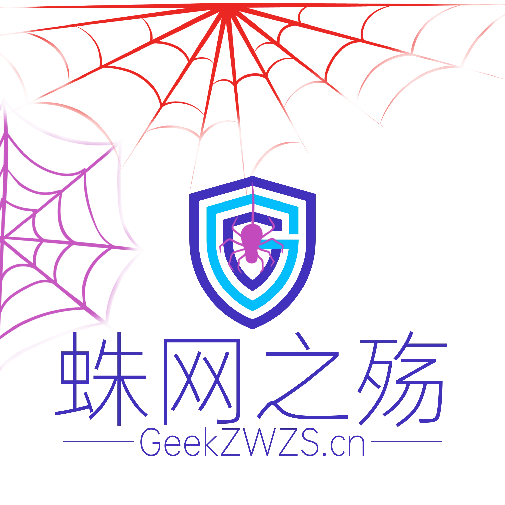

# 欢迎访问蛛网之殇

# 我们是谁：
> 我们是一群学生，酷爱IT技术；时常喜欢别人称我们为白帽子。

> 我们也是游走于各IT大博客的博主，为刚入门的小白带来帮助并记录我们技术研究的点点滴滴。
# 我们要做什么？
> 我们需要一个自定义化的论坛，在那里面没有等级之分，拒绝vip才能访问的贴子、下载的资源。（当然不是为了毕业设计）

# 我们为什么要这么做？
> 天下熙熙皆为利来；天下攘攘皆为利往。目前互联网上鱼龙混杂，各大IT社区层出不穷中；饱私囊之后纷纷解散留下在风雨中发呆的版主。

>我们饱受其中的艰辛，决定创立一个近乎完美和谐的社区，为互联网世界带来彩虹！创立它们我们并不获利。

# 什么在维持？
>非常感谢“三丰云"https://www.sanfengyun.com/ 为我们免费提供雄厚的硬件支持，也期待广大IT爱好者未来能加入我们的社区。
>目前我们正在开发中，过不了多久就可以投入使用了。

<a rel="nofollow" target="_blank" href="http://geekzwzs.cn">©蛛网之殇应急响应中心</a> ©安全小飞侠监制MR.SUN ©南哥监制MR.LI <a href="https://bbs.pediy.com/user-home-908872.htm" rel="nofollow" title="©网络小蜘蛛 MR.PENG" target="_blank">©网络小蜘蛛 MR.PENG</a> And <a href="https://www.cnblogs.com/Deng-Xian-Sheng/" rel="nofollow" title="Karch制作 MR.JIN" target="_blank">Karch MR.JIN</a>制作